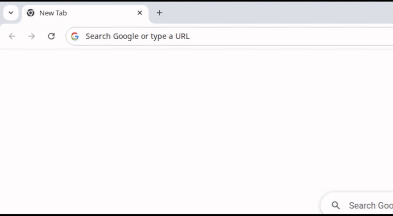

<div align="center">


<h1 align="center">Duckling Browser Extension</h1>

<h3>Bring native DuckDuckGo bangs into your browser search bar</h3>



</div>

# Usage

1. In the search bar, type "! " (exclamation mark, then space).
2. Start typing a bang (e.g. gh, so, npm, wiki) and pick from live suggestions.
3. Add your query and press Enter to jump directly to target site.

# Key Benefits

* ⚡ **Instant**: No network requests, DNS hops, or redirects. Suggestions and query resolution happen locally inside the extension. You'll notice the difference!
* 🧠 **Don't memorize bangs**: Type-ahead suggestions surface the right bang as you type.
* 🧩 **Default search engine choice**: Use whatever default search engine you like alongside Duckling. Use DuckDuckGo's best feature - no DuckDuckGo required.
* 🔒 **Privacy-first**: No telemetry, no request tracking - your data stays on your device.
* ❤️ **Open source**: Transparent, auditable and only does what it's supposed to. Review the code, open issues and contribute.

# Installation

## Via Chrome Web Store

1. Go to Duckling [Chrome extension page](https://chromewebstore.google.com/detail/duckling/kkhpjkabnebjkdpcpagdpcchpcdjnonp).
2. Click on "Add to Chrome".
3. Enable the extension.

## Build and install extension from source

1. Clone the repository
```bash
git clone git@github.com:theonekeyg/duckling.git
```
2. Install dependencies
```bash
pnpm install
```
3. Build the extension bundle
```
pnpm build
```
4. Open Chrome extension page (chrome://extensions).
5. Enable "Developer mode" in top right.
6. Click on "Load unpacked" in the top left and select the directory `.output/chrome-mv3`.
